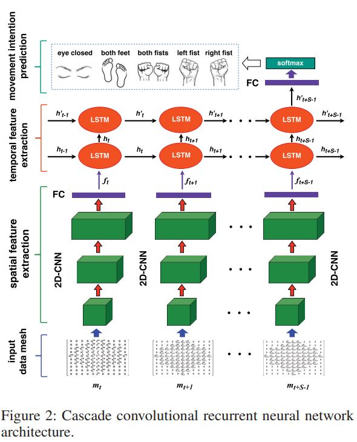
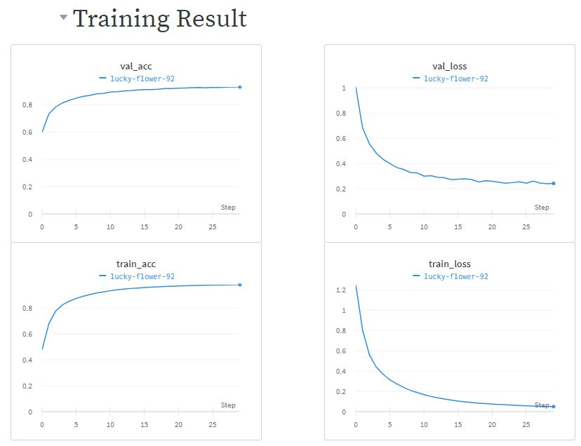

# Cascade and Parallel Convolutional Recurrent Neural Networks on EEG-Based Intention Recognition for Brain Computer Interface

In this repo, we reproduce a methodology from a [paper](https://aaai.org/ocs/index.php/AAAI/AAAI18/paper/view/16107/15871) by Zhang et al.

Abstract Architecture:

Training Result:

for more detail result open: [Wandb](https://wandb.ai/nadenny/my-test-project/reports/Cascade-and-Parallel-Convolutional-Recurrent-Neural-Networks-on-EEG-Based-Intention-Recognition-for-Brain-Computer-Interface--VmlldzoxMTg3Njg3)
